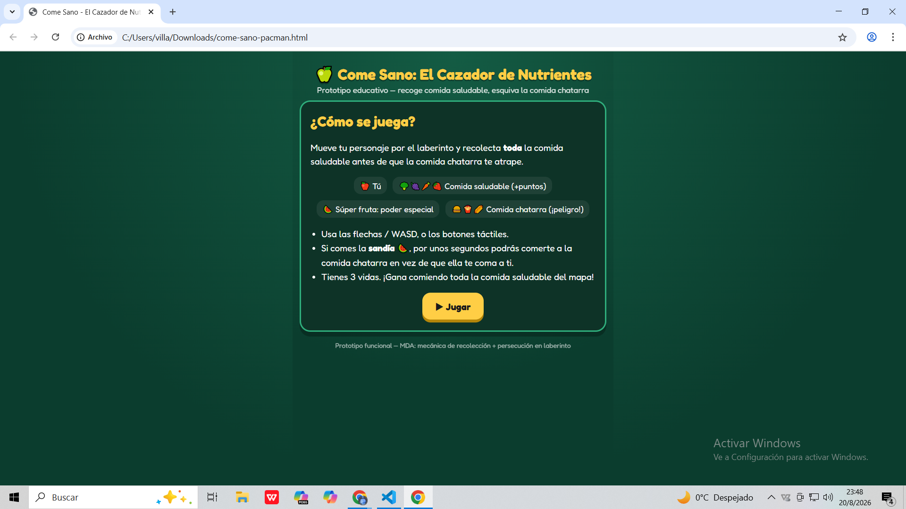
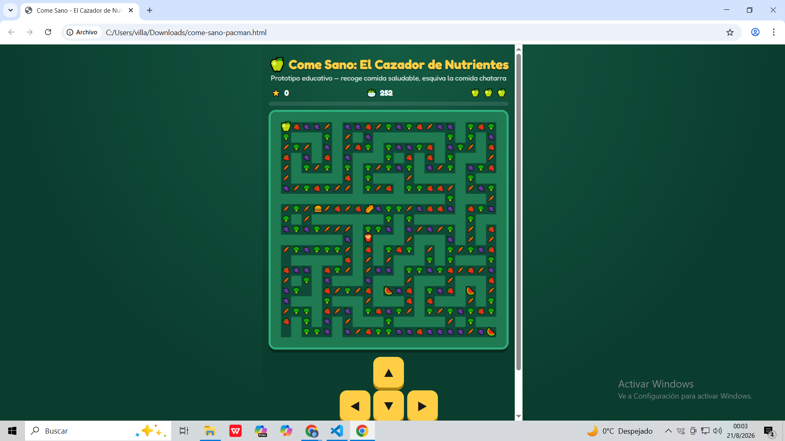
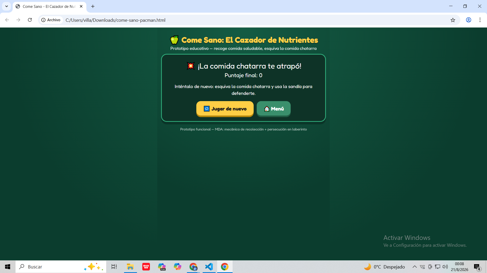

# Come Sano: El Cazador de Nutrientes

## Descripción

**¿De qué trata?**  
Come Sano: El Cazador de Nutrientes es una reinterpretación educativa de Pac-Man. El jugador se mueve por un laberinto recolectando comida saludable mientras evita la comida chatarra que lo persigue.

**¿Cuál es el objetivo del jugador?**  
El objetivo es recolectar toda la comida saludable del mapa antes de perder las 3 vidas disponibles. Al recoger la súper fruta se activa un modo especial durante unos segundos, permitiendo al jugador enfrentarse a la comida chatarra.

**¿Cuál es la mecánica principal?**  
La mecánica principal combina recolección y persecución dentro de un laberinto. Además, cuenta con un power-up temporal que permite invertir los roles entre el jugador y los enemigos.

## Género

Arcade

## Controles

| Tecla / Botón | Acción |
|---|---|
| Flecha arriba / W | Mover hacia arriba |
| Flecha abajo / S | Mover hacia abajo |
| Flecha izquierda / A | Mover a la izquierda |
| Flecha derecha / D | Mover a la derecha |
| Botones táctiles direccionales | Mover al personaje en dispositivos táctiles |

## Capturas de pantalla

### Pantalla inicial

### Gameplay

### Fin de partida

## Tecnología

HTML5, CSS3 y JavaScript utilizando Canvas API, sin utilizar motores externos.
