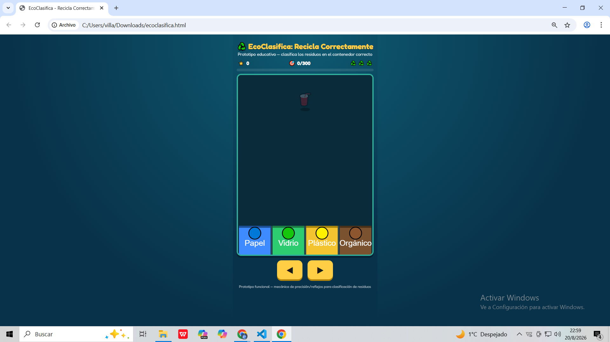
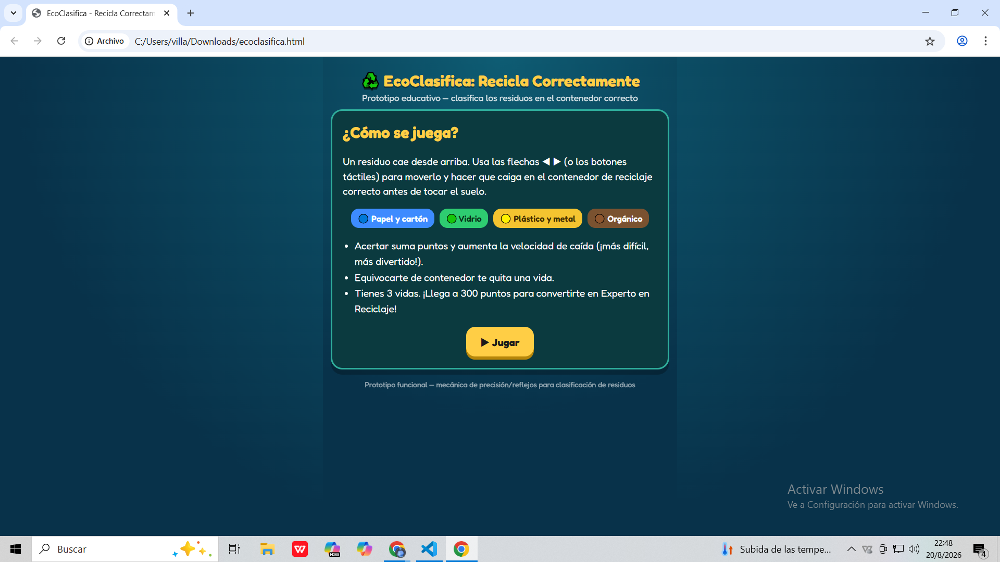
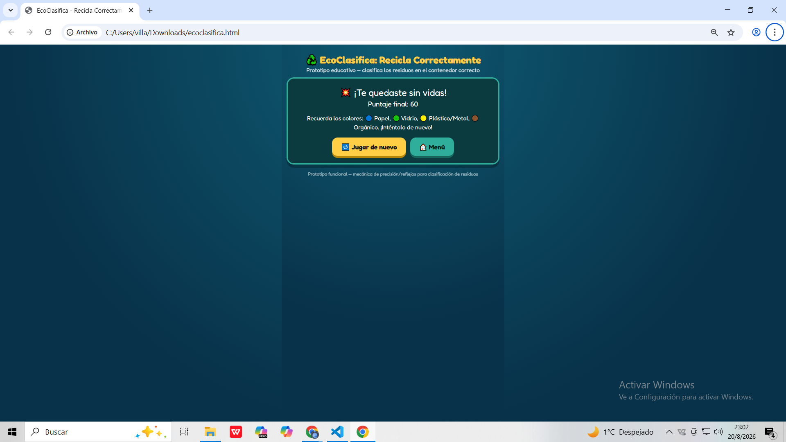

 EcoClasifica: Recicla Correctamente

Videojuego arcade educativo sobre reciclaje, precisión y velocidad de reacción.

 Descripción

EcoClasifica: Recicla Correctamente** es un videojuego educativo de género **arcade** en el que el jugador debe clasificar diferentes residuos en el contenedor correspondiente antes de que lleguen al suelo.

Durante la partida aparecen residuos desde la parte superior de la pantalla. El jugador debe moverlos y colocarlos en el contenedor correcto según el tipo de material:

*  Papel / cartón
*  Vidrio
*  Plástico / metal
*  Orgánico

La velocidad de caída aumenta progresivamente, por lo que el jugador necesita mejorar su precisión y velocidad de reacción.

 Objetivo del jugador

El objetivo principal es alcanzar **300 puntos** clasificando correctamente los residuos y conservar las **3 vidas disponibles**.

Al conseguirlo, el jugador se convierte en:

Experto en Reciclaje

El juego busca combinar entretenimiento con aprendizaje, ayudando al jugador a reconocer diferentes tipos de residuos y conocer el contenedor en el que deben depositarse.
 ¿Cómo se juega?

1. Un residuo aparece en la parte superior de la pantalla.
2. El jugador identifica el tipo de residuo.
3. Mueve el residuo hacia el contenedor correspondiente.
4. Si la clasificación es correcta, obtiene puntos.
5. Si se equivoca o el residuo llega al suelo, pierde una vida.
6. Conforme consigue aciertos, la velocidad aumenta.

La mecánica principal combina **precisión, reflejos y toma de decisiones bajo presión**.

 Controles

| Tecla / Botón           | Acción                                    
| -----------------------  ----------------------------------------- 
|  Flecha izquierda / A  Mover el residuo hacia la izquierda       
|  Flecha derecha / D    Mover el residuo hacia la derecha         
|  Botones táctiles      Mover el residuo en dispositivos táctiles 

 Tecnologías utilizadas

* HTML5
* CSS3
* JavaScript
* Canvas API

El juego fue desarrollado para ejecutarse directamente desde el navegador sin necesidad de instalar software adicional.

 Uso y apoyo de IA

Durante el desarrollo se utilizó inteligencia artificial como herramienta de apoyo para:

* Comprender conceptos de programación.
* Resolver dudas sobre HTML, CSS y JavaScript.
* Generar y analizar partes de código.
* Explorar diferentes formas de implementar las mecánicas del juego.
* Detectar errores y buscar posibles soluciones.
* Mejorar algunas ideas relacionadas con la jugabilidad.

La IA fue utilizada como apoyo durante el proceso de desarrollo, mientras que las decisiones sobre el diseño, funcionamiento y características finales del videojuego fueron tomadas durante la creación del proyecto.

 Capturas de pantalla

 Pantalla Jgabilidad

 Pantalla de inicio

 Fin de partida

 ¿Qué aprendí?

Durante el desarrollo de **EcoClasifica** aprendí a trabajar con JavaScript y Canvas para crear una experiencia interactiva dentro del navegador.

También aprendí sobre el manejo de objetos, movimiento, detección de situaciones dentro del juego, sistema de puntuación, vidas y aumento progresivo de la dificultad.

Además, comprendí mejor cómo utilizar la inteligencia artificial como herramienta de apoyo para aprender programación, resolver problemas y desarrollar nuevas ideas para un videojuego.

 ¿Qué mejoraría en una próxima versión?

En una siguiente versión realizaría diferentes mejoras:

*  Mejorar los gráficos y las animaciones.
*   Agregar personajes o elementos visuales más elaborados.
*  Incorporar efectos de sonido y música.
*  Agregar más tipos de residuos.
*  Crear un sistema de récords y puntuaciones máximas.
*  Mejorar la adaptación para dispositivos móviles.
*  Agregar diferentes niveles de dificultad.
*  Incorporar más efectos visuales al conseguir puntos o perder vidas.

 Propósito del juego

Además de entretener, **EcoClasifica** busca transmitir de una manera sencilla e interactiva la importancia de separar correctamente los residuos.

El juego convierte una actividad cotidiana como el reciclaje en una experiencia de reflejos y toma de decisiones.
