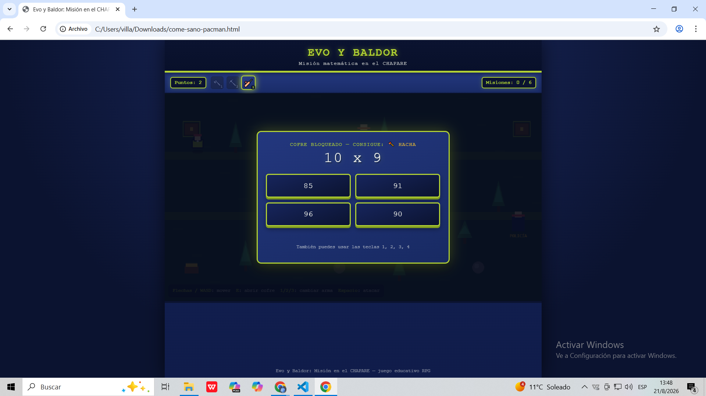

# Evo y Baldor: Misión en el CHAPARE

## Descripción

Videojuego RPG top-down ambientado en la región del Chapare, donde el jugador acompaña a Evo y Baldor en una misión de exploración. El mapa contiene cofres, obstáculos naturales y patrullas policiales que dificultan el avance.

El jugador deberá explorar el escenario, resolver operaciones matemáticas para abrir cofres y obtener diferentes herramientas, y utilizarlas correctamente para superar los desafíos que aparecen durante la misión.

## Objetivo

Completar los 6 objetivos del mapa utilizando las herramientas adecuadas para cada situación. Para avanzar, el jugador deberá conseguir y equipar herramientas como el hacha, la pala y el palo, además de enfrentarse o evitar las patrullas policiales presentes en la zona.

## Mecánica principal

La mecánica combina exploración, resolución de acertijos matemáticos y gestión de herramientas. Los cofres requieren resolver operaciones matemáticas para desbloquear el equipo, mientras que cada obstáculo requiere utilizar la herramienta correspondiente.

El jugador debe explorar el mapa, decidir qué herramienta utilizar en cada situación y administrar sus recursos para completar todos los objetivos de la misión.

## Género

RPG

## Controles

| Tecla / Botón | Acción |
|---|---|
| Flechas / WASD | Mover al personaje |
| E | Abrir un cofre cercano |
| 1 | Equipar el hacha, si está disponible |
| 2 | Equipar la pala, si está disponible |
| 3 | Equipar el palo, si está disponible |
| Espacio | Atacar o utilizar la herramienta equipada sobre el objetivo |

## Objetivos

Durante la misión, el jugador deberá completar 6 objetivos distribuidos por el mapa, entre ellos:

- Resolver operaciones matemáticas para abrir cofres.
- Conseguir nuevas herramientas.
- Talar árboles utilizando el hacha.
- Despejar derrumbes utilizando la pala.
- Enfrentar o evitar las patrullas policiales.
- Completar todos los objetivos de la misión.

## Capturas de pantalla

### Pantalla de bienvenida

### Gameplay

### Misión completada

## Tecnología

HTML5, CSS3, JavaScript (Canvas API) — sin motor externo.
