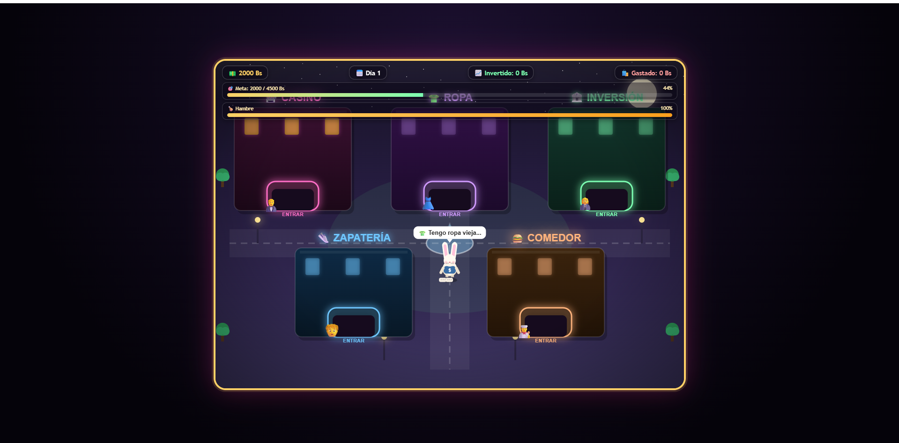

# 2000 Bs: La Ciudad de las Decisiones

## Descripción

**¿De qué trata?** El jugador controla a un personaje que inicia con un capital de 2000 Bs y debe recorrer una ciudad explorando diferentes edificios donde podrá tomar decisiones sobre cómo administrar su dinero. Podrá arriesgarlo en el Casino, invertirlo en el Banco de Inversión o gastarlo en establecimientos como la Zapatería, el Comedor y la tienda de Ropa, donde cada decisión influirá en su progreso.

**¿Cuál es el objetivo del jugador?** Alcanzar un patrimonio total de 4500 Bs, sumando el dinero disponible y las inversiones realizadas, sin quedarse sin recursos económicos. Además, deberá administrar su nivel de hambre para evitar que afecte su desempeño durante la partida.

**¿Cuál es la mecánica principal?** Simulación de toma de decisiones financieras basada en la gestión de recursos. El jugador debe equilibrar el riesgo y la seguridad al decidir entre apostar en el casino, invertir para obtener ganancias a largo plazo o cubrir necesidades básicas sin comprometer su capital.

## Género

Estrategia (Simulación de decisiones financieras)

## Controles

| Acción / Input | Efecto |
|---|---|
| Flechas o WASD | Mover al personaje por la ciudad |
| E | Entrar al edificio más cercano (Casino, Banco de Inversión, Zapatería, Comedor o Tienda de Ropa) |
| Clic o toque sobre los botones | Seleccionar apuestas, inversiones o compras dentro de cada establecimiento |

## Capturas de pantalla

### Pantalla de inicio

### Gameplay

### Pantalla de victoria o derrota

## Tecnología

HTML5, CSS3 y JavaScript (Canvas API), desarrollado sin utilizar motores de videojuegos externos.
