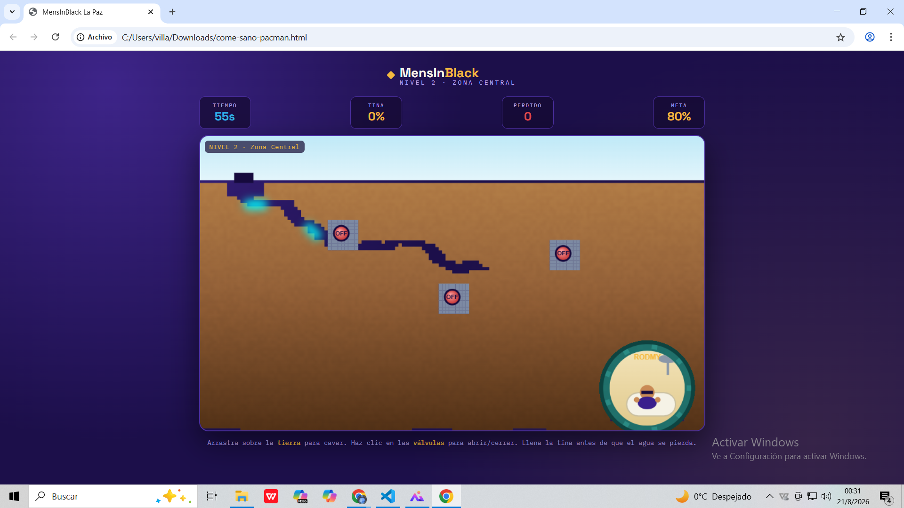

# MensInBlack La Paz

## Descripción

**¿De qué trata?** El Agente Rodmy, un estudiante universitario de La Paz, necesita bañarse. El jugador debe cavar túneles en la tierra arrastrando el cursor y abrir o cerrar válvulas para guiar el agua desde la tubería hasta su tina.

**¿Cuál es el objetivo del jugador?** Llenar la tina hasta alcanzar el porcentaje meta de agua antes de que se acabe el tiempo o de que demasiada agua se pierda por los desagües, avanzando a través de 3 niveles: Barrio Sur, Zona Central y Ladera Alta. Cada nivel es más exigente que el anterior.

**¿Cuál es la mecánica principal?** Puzzle de física de fluidos combinado con gestión de recursos bajo presión de tiempo: cavar el camino correcto y sincronizar las válvulas para minimizar las pérdidas de agua.

## Género

Puzzle

## Controles

| Acción / Input | Efecto |
|---|---|
| Clic + arrastrar sobre la tierra | Cavar túneles para guiar el agua |
| Clic sobre una válvula | Abrir o cerrar la válvula |
| Toque + arrastrar | Cavar túneles en dispositivos táctiles |
| Toque sobre una válvula | Abrir o cerrar la válvula en dispositivos táctiles |

## Capturas de pantalla

### Pantalla de inicio

### Gameplay

### Fin de nivel

## Tecnología

HTML5, CSS3, JavaScript (Canvas API) — sin motor externo.
