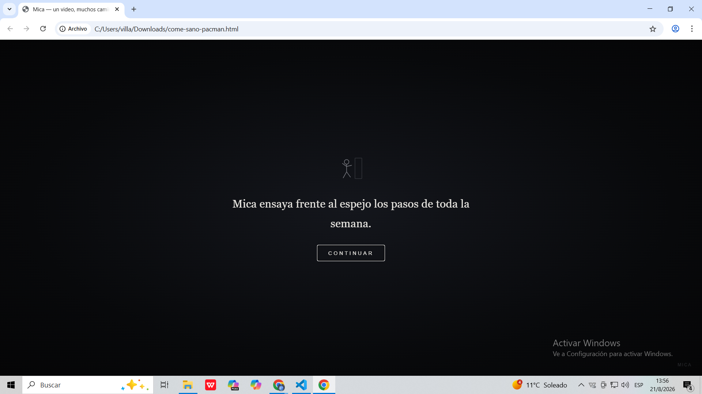
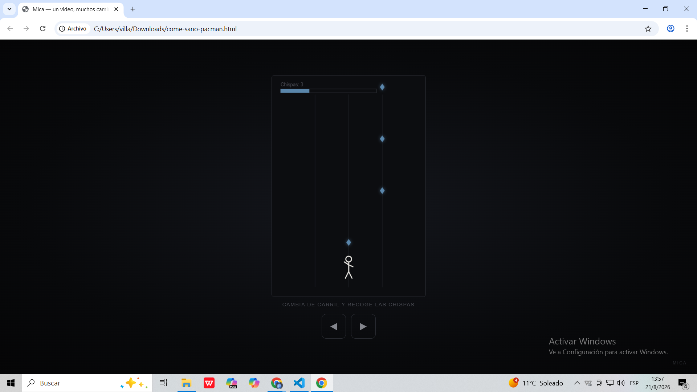
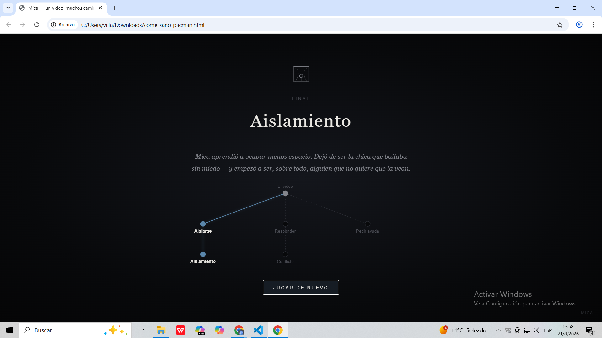

# Mica: Un video, muchos caminos

## Descripción

Videojuego de narrativa interactiva protagonizado por Mica, una joven cuyo video se viraliza sin su consentimiento. A lo largo de la historia, el jugador deberá tomar diferentes decisiones que determinarán cómo Mica enfrenta las situaciones que se presentan.

Cada decisión conduce a un mini-juego diferente, permitiendo que las elecciones del jugador no solo cambien la historia, sino que también se reflejen directamente en la jugabilidad.

## Objetivo

Acompañar a Mica a través de las diferentes situaciones y decisiones de la historia, superando los mini-juegos asociados a cada camino hasta llegar a uno de los finales posibles.

Al finalizar, el jugador podrá visualizar un árbol de decisiones que muestra el camino recorrido y las elecciones realizadas durante la historia.

## Mecánica principal

La mecánica combina una narrativa ramificada con mini-juegos de movimiento y reflejos.

El jugador deberá elegir entre diferentes opciones de diálogo y posteriormente enfrentarse a un mini-juego relacionado con la decisión tomada. Los desafíos incluyen esquivar comentarios, cambiar de carril, escapar de situaciones de presión, sobrevivir a una ola de mensajes y acercarse a una persona de confianza para pedir ayuda.

Las decisiones tomadas a lo largo de la historia determinan las situaciones y consecuencias que experimentará Mica.

## Género

Aventura narrativa interactiva con mini-juegos de reflejos.

## Controles

| Tecla / Botón | Acción |
|---|---|
| Clic / Tap | Elegir una opción de diálogo |
| A / D | Cambiar de carril en el mini-juego de baile |
| Flechas / WASD | Moverse en los mini-juegos de esquivar |
| Botones táctiles | Controlar al personaje en dispositivos móviles |

## Características

- Narrativa interactiva con diferentes caminos.
- Decisiones que modifican el desarrollo de la historia.
- Mini-juegos asociados a las decisiones.
- Diferentes finales posibles.
- Árbol de decisiones al finalizar la partida.
- Controles compatibles con teclado y dispositivos táctiles.

## Capturas de pantalla

### Historia y diálogo

### Mini-juego

### Árbol de decisiones

## Tecnología

HTML5, CSS3, JavaScript (Canvas API) — sin motor externo.
